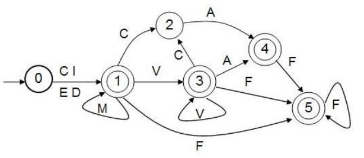

# Myanmar Syllable Segmentation — Step-by-step README

**Based on:** *A Rule-based Syllable Segmentation of Myanmar Text* (Zin Maung Maung & Yoshiki Mikami, IJCNLP-08)

---

## Goal
Provide a clear, step-by-step explanation of a rule-based approach to segment Myanmar (Burmese) text into syllables, following the rules, tables, and flow described in the referenced paper. This README serves as a guide to understanding and using the Myanmar Syllable Segmentation Python library.

---

## 1. Background & Key Concepts
- Myanmar script does **not** use spaces between words; syllable segmentation is a core preprocessing step for many NLP tasks (word segmentation, line breaking, sorting).
- The approach is **rule-based**, using the Myanmar syllable structure and category-based letter-sequence tables.
- The algorithm operates on Unicode-encoded text using a Unicode model (UTN11-2).

### Classification of Myanmar Script

The following table summarizes the Unicode categories used in Myanmar syllable segmentation. Each category includes example glyphs and their Unicode code points.

| Category | Name                            | Glyphs (examples)                                | Unicode Code Points | Notes |
|----------|---------------------------------|-------------------------------------------------|-------------------|-------|
| **C**    | Consonants                      | က ခ ဂ ဃ င စ ဆ ဇ ဈ ဉ ည ဋ ဌ ဍ ဎ ဏ တ ထ ဒ ဓ န ပ ဖ ဗ ဘ မ ယ ရ လ ဝ သ ဟ ဠ အ | U+1000–U+1021 | Base letters; typically start syllables |
| **M**    | Medials                         | ျ ျွ ြ                                     | U+103B–U+103E | Modify consonants in syllables |
| **V**    | Dependent Vowel Signs           | ာ ါ ိ ီ ု ူ ေ ါဲ                                  | U+102B–U+1032 | Attach to consonants to indicate vowels |
| **S**    | Virama                          | ◌္                                             | U+1039 | Suppresses inherent vowel |
| **A**    | Asat (Devoweliser)              | ◌်                                             | U+103A | Marks final consonant without vowel |
| **F**    | Dependent Various Signs         | ံ ့ း                                           | U+1036–U+1038 | Tone marks and other diacritics |
| **I**    | Independent Vowels / Signs      | ဤ ဧ ဪ ၌ ွ ၏                                     | U+1024, U+1027, U+102A, U+104C, U+104D, U+104F | Standalone vowels or signs |
| **E**    | Independent Vowels / Symbols    | ဣ ဥ ဦ ဩ ၎                                      | U+1023, U+1025, U+1026, U+1029, U+104E | Rare independent vowels |
| **G**    | Myanmar Letter Great Sa         | ဿ                                              | U+103F | Special consonant used in classical texts |
| **D**    | Digits                          | ၀ ၁ ၂ ၃ ၄ ၅ ၆ ၇ ၈ ၉                               | U+1040–U+1049 | Numeric digits |
| **P**    | Punctuation Marks               | ၊ ။                                           | U+104A–U+104B | Sentence punctuation |
| **W**    | White space                     | (space)                                         | U+0020 | Word or syllable separator |

### Important character categories (short)
- **C**: Consonants (U+1000–U+1021)
- **M**: Medials (U+103B–U+103E)
- **V**: Dependent vowels (U+102B–U+1032, etc.)
- **S**: Virama (U+1039)
- **A**: Asat (U+103A)
- **F**: Dependent various signs (U+1036–U+1038)
- **I / E / G / D / P / W**: Independent vowels, Great Sa, Digits, Punctuation, White space (see the paper for full mappings)
  
(See the table above for the complete mapping of Myanmar glyphs to categories and their Unicode code points.)

---

## 2. Myanmar Syllable Structure (summary)
A Myanmar syllable can be represented roughly as:

```
Syllable ::= C {M} {V} {F}
           | C {M} V+ A
           | C {M} {V} C A [F]
           | E [C A] [F]
           | I
           | D
```

Where:
- `C` = consonant
- `{M}` = zero or more medials
- `{V}` = zero or more vowels
- `A` = Asat (devoweliser)
- `S` = Virama
- `E`, `I`, `D` = independent vowel / signs / digits

---

### Finite State Automaton (FSA) for Syllable Structure



## 3. High-level Algorithm
1. **Preprocessing**
   - Normalize input to Unicode canonical order.
   - Remove or handle non-Myanmar characters.
2. **Map characters to categories**
   - Convert each character to its category label (`C, M, V, S, A, F, I, E, G, D, P, W`).
3. **Use letter-sequence tables**
   - Three tables: pairs (2-char), triples (3-char), quadruples (4-char).
   - Cell values indicate break status:
     - `-1`: illegal / ambiguous
     - `0`: no break
     - `1-4`: break after Nth char
4. **Sliding window logic**
   - Compare up to 4-character sequences against tables.
   - Insert syllable boundary (`|`) according to break status.

---

## 4. Special Cases
- Devowelising sequences: second consonant + Asat → single syllable.
- Subjoined consonants (via Virama) → do not break.
- Kinzi pattern → single syllable.
- Great Sa (U+103F) → no break before.
- Contractions / double-acting consonants → keep as single chained form.

---

## 5. Implementation Steps
1. **Build category mapper**
   - Define global character sets for each category (`C, M, V, S, A, F, I, E, G, D, P, W`) using Unicode glyphs.
   - Map each input character to its category for use in lookup tables.

2. **Normalization**
   - Ensure input text is in canonical Unicode order for consistent processing.

3. **Letter-sequence lookup tables**
   - Implement the **primary table (`twoConsecutive`)** for 2-character sequences.
   - Implement **secondary (`threeConsecutive`)** and **tertiary (`fourConsecutive`)** tables for 3- and 4-character sequences, resolving ambiguous cases.

4. **Syllable segmentation engine**
   - Iterate over the input text.
   - Map each character to its category.
   - Apply the lookup tables in order (primary → secondary → tertiary) to determine where to insert syllable boundaries (`|`).
   - Handle special cases like `-1` (illegal/ambiguous) or `9` (escalate to deeper lookup).

5. **Post-processing**
   - Remove trailing separators, handle punctuation and whitespace.
   - Ensure Great Sa (U+103F) and special independent vowels are correctly processed.

---

## 6. Pseudocode
```
function syllableSegment(text):
    # Step 1: Normalize the input text
    text = normalize_unicode(text)

    # Step 2: Map each character to a category (consonant, vowel, medial, etc.)
    categories = map_characters_to_categories(text)

    # Step 3: Convert categories to indices for lookup in the transition table
    indices = convert_categories_to_indices(categories)

    # Step 4: Initialize output
    segmented_text = ""

    # Step 5: Iterate through the text and apply segmentation rules
    for each pair of consecutive indices (current, next):
        case = twoConsecutive[current][next]

        if case == 0:
            append current character to segmented_text
        elif case == 1:
            append current character + "|" to segmented_text
        elif case == 2:
            append current character without separator
        elif case == 9:
            perform deeper lookup for complex sequences
        elif case == -1:
            handle invalid sequence (optional marker)

    # Step 6: Return the segmented text
    return segmented_text
```


### Key Points

- Each character is categorized based on Myanmar script rules.  
- `twoConsecutive` table defines how consecutive characters are segmented.  
- Output uses `|` to separate syllables.  
- Special cases (`case 9`) handle more complex patterns.  
- Invalid sequences (`case -1`) can be marked or ignored.  

---

## 7. Examples
- Input: `မားစ်ဂိုဟ်` → segmented as `မားစ်|ဂိုဟ်|`
- Input: `မနုဿ` → contains Great Sa → no break before ဿ

---

## 8. References
- Z. M. Maung and Y. Mikami, “[A Rule-based Syllable Segmentation of Myanmar Text](https://aclanthology.org/I08-3010/),” *Proceedings of the IJCNLP-08 Workshop on NLP for Less Privileged Languages*, Hyderabad, India, Jan. 2008.

